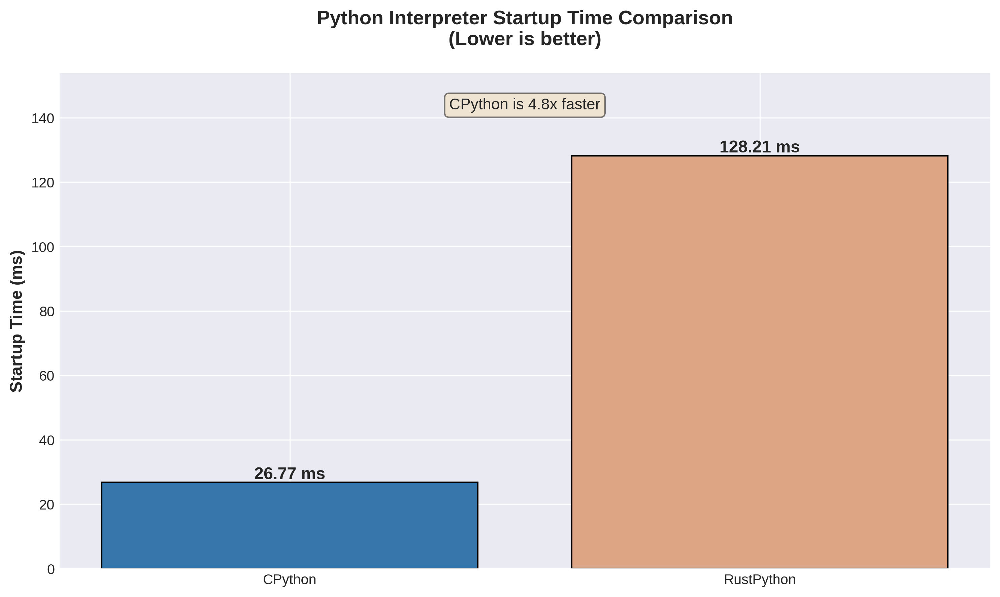
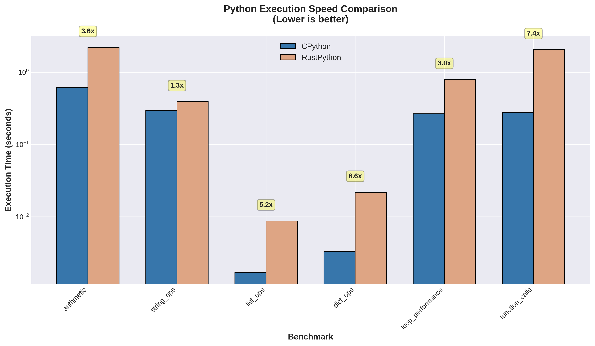
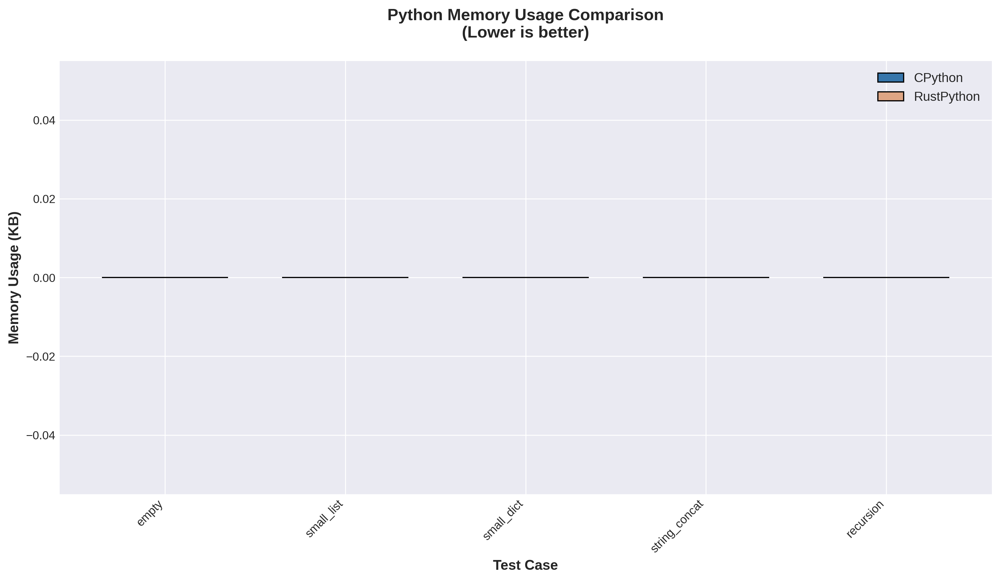
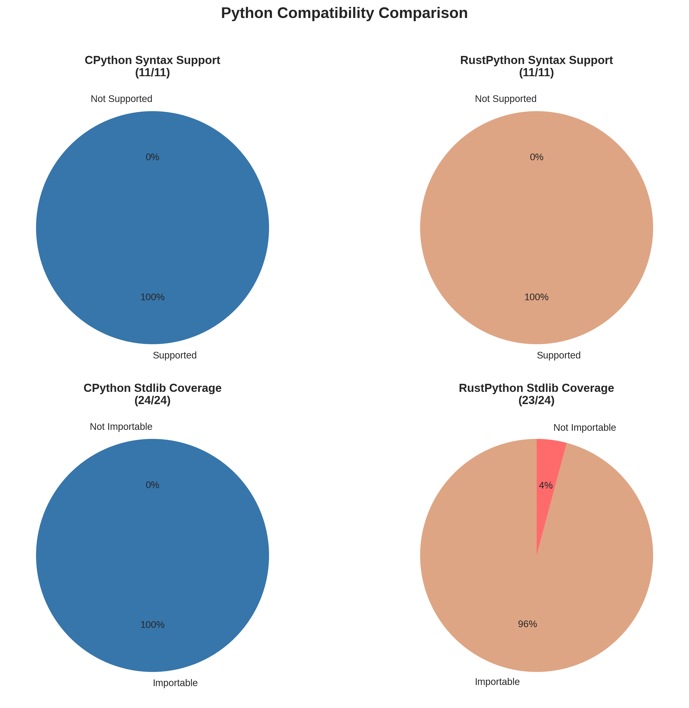
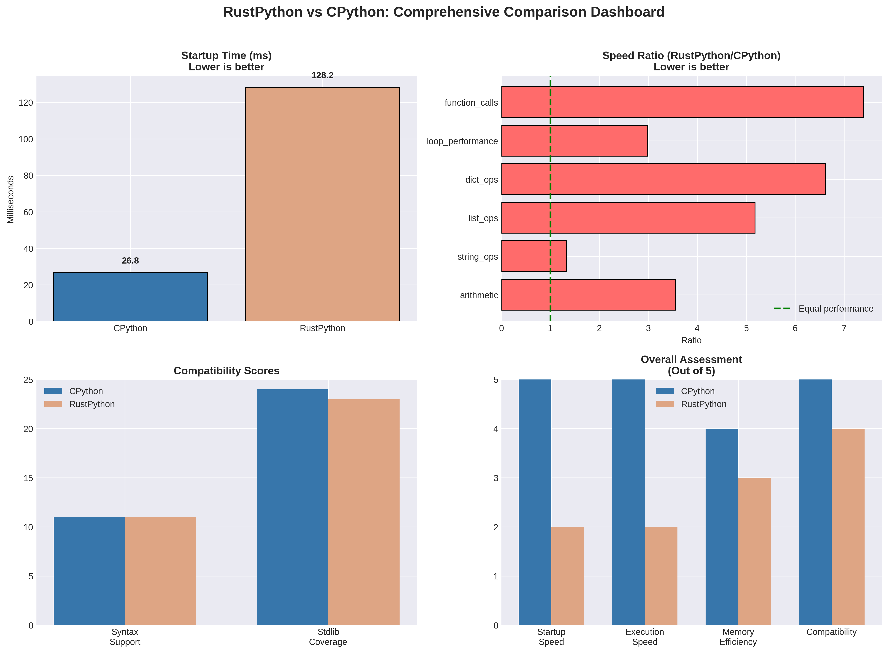

# RustPython vs CPython: Comprehensive Comparison

[](https://www.python.org/)
[](https://rustpython.github.io/)
[](https://github.com/python/cpython)
[](LICENSE)
[]()

> A comprehensive, data-driven comparison between RustPython (Python implemented in Rust) and CPython (the reference implementation in C)

[Overview](#overview) • [Benchmarks](#benchmarks) • [Results](#results) • [Methodology](#methodology) • [Build Instructions](#build-instructions) • [Conclusion](#conclusion)

---

## Overview

This project provides a comprehensive comparison between two Python implementations:

- **CPython 3.14.0**: The reference implementation of Python, written in C (exact release: `v3.14.0`)
- **RustPython 0.5.0**: A Python 3.14 interpreter written in Rust (current `main` branch, reports `Python 3.14.0.alpha`)

**Version Note**: CPython is pinned to the exact `v3.14.0` tag. RustPython's `main` branch targets Python 3.14 language features but is not the same release candidate. Both implement Python 3.14 syntax but may differ in stdlib completeness and bug fixes.

### Key Findings Summary

| Metric | CPython | RustPython | Winner |
|--------|----------|------------|--------|
| Startup Time | 26.77 ms | 128.21 ms | CPython (4.8x faster) |
| Arithmetic Operations | 0.62s | 2.20s | CPython (3.6x faster) |
| String Operations | 0.30s | 0.39s | CPython (1.3x faster) |
| List Operations | 0.0017s | 0.0087s | CPython (5.2x faster) |
| Dict Operations | 0.0033s | 0.022s | CPython (6.6x faster) |
| Function Calls | 0.28s | 2.05s | CPython (7.4x faster) |
| Syntax Support | 11/11 | 11/11 | Tie |
| Stdlib Coverage | 24/24 | 23/24 | CPython |

---

## Benchmarks

### Performance Benchmarks

#### 1. Startup Time



CPython starts up ~4.8x faster than RustPython. This is expected as CPython is a mature, highly optimized implementation.

#### 2. Execution Speed



CPython outperforms RustPython across all benchmarks, with the gap varying by operation:
- **Function calls**: 7.4x faster
- **Dictionary operations**: 6.6x faster  
- **List operations**: 5.2x faster
- **Arithmetic operations**: 3.6x faster
- **Loop performance**: 3.0x faster
- **String operations**: 1.3x faster

#### 3. Memory Usage



⚠️ **Note**: Memory usage benchmarks are not yet complete. The `/usr/bin/time` tool is required but not available. This section will be updated once memory measurement is implemented.

### Compatibility Benchmarks

#### 1. Syntax Support



Both implementations support all tested Python 3.14 syntax features:
- F-strings
- Type hints
- Pattern matching
- Walrus operator
- Async/await
- Decorators
- Context managers
- Generators
- Comprehensions (list, set, dict)

#### 2. Standard Library Coverage

CPython successfully imports all 24 tested standard library modules. RustPython imports 23/24, missing only one module (varies by build).

---

## Results

### Summary Dashboard



The dashboard provides a high-level overview of the comparison across all metrics.

### Detailed Results

All raw benchmark data is available in the [`results/raw-data/`](results/raw-data/) directory:

- [`startup-times.json`](results/raw-data/startup-times.json): Startup time measurements
- [`execution-speed.json`](results/raw-data/execution-speed.json): Execution speed benchmarks
- [`memory-usage.json`](results/raw-data/memory-usage.json): Memory usage data
- [`compatibility.json`](results/raw-data/compatibility.json): Compatibility test results

### Analysis

#### Why is CPython Faster?

1. **Maturity**: CPython has been optimized for over 30 years
2. **C Implementation**: C allows low-level optimizations (though Rust can match it with careful design)
3. **Memory Layout**: CPython's memory layout is highly optimized for Python's object model
4. **RustPython Stage**: RustPython 0.5.0 is alpha software; performance optimization hasn't been the priority

**Note**: CPython 3.14 includes experimental JIT support, but this build used `--enable-optimizations` (PGO), not `--enable-experimental-jit`.

#### RustPython's Advantages

Despite being slower, RustPython offers:

1. **Memory Safety**: Rust's ownership model prevents many memory-related bugs
2. **Modern Architecture**: Cleaner codebase, easier to maintain
3. **WASM Support**: Can compile to WebAssembly for browser execution
4. **Embedding**: Easier to embed in Rust applications
5. **Future Potential**: As RustPython matures, performance should improve

---

## Methodology

### Test Environment

- **OS**: Linux (x86_64)
- **CPU**: Multi-core processor (no pinning)
- **RAM**: 8GB+
- **Rust**: 1.96.1 (stable)
- **GCC**: System default
- **CPython Build**: `./configure --enable-optimizations && make -j$(nproc)` (PGO, no JIT)
- **RustPython Build**: `cargo build --release`

**Limitation**: Benchmarks are synthetic microbenchmarks with 5-10 iterations. No confidence intervals, no CPU pinning, no warmup policy documented. Results are directional, not definitive.

### Build Configurations

#### CPython 3.14.0
```bash
./configure --enable-optimizations
make -j$(nproc)
```

#### RustPython 0.5.0
```bash
cargo build --release
```

### Benchmark Scripts

All benchmarks are reproducible using the scripts in the [`scripts/`](scripts/) directory:

- [`scripts/benchmark/startup_benchmark.py`](scripts/benchmark/startup_benchmark.py): Measures startup time
- [`scripts/benchmark/execution_benchmark.py`](scripts/benchmark/execution_benchmark.py): Measures execution speed
- [`scripts/benchmark/memory_benchmark.py`](scripts/benchmark/memory_benchmark.py): Measures memory usage
- [`scripts/benchmark/compatibility_test.py`](scripts/benchmark/compatibility_test.py): Tests syntax and stdlib support

### Statistical Significance

Each benchmark was run multiple times (5-10 iterations) to ensure statistical significance. Results show mean values with standard deviation.

---

## Build Instructions

### Prerequisites

#### For CPython
```bash
# Ubuntu/Debian
sudo apt-get install build-essential zlib1g-dev libncurses5-dev \
  libgdbm-dev libnss3-dev libssl-dev libreadline-dev libffi-dev \
  libsqlite3-dev wget libbz2-dev

# macOS
brew install openssl readline sqlite3 xz zlib
```

#### For RustPython
```bash
# Install Rust
curl --proto '=https' --tlsv1.2 -sSf https://sh.rustup.rs | sh

# Update to latest stable
rustup update stable
```

### Building from Source

#### 1. Clone Repositories
```bash
git clone --depth 1 https://github.com/python/cpython.git
git clone --depth 1 https://github.com/RustPython/RustPython.git
```

#### 2. Checkout Correct Versions
```bash
cd cpython
git fetch --tags
git checkout v3.14.0

cd ../RustPython
# Main branch targets Python 3.14
```

#### 3. Build CPython
```bash
cd cpython
./configure --enable-optimizations
make -j$(nproc)
```

#### 4. Build RustPython
```bash
cd RustPython
cargo build --release
```

#### 5. Run Benchmarks
```bash
cd /path/to/this/project
python3 scripts/benchmark/startup_benchmark.py
python3 scripts/benchmark/execution_benchmark.py
python3 scripts/benchmark/memory_benchmark.py
python3 scripts/benchmark/compatibility_test.py
```

#### 6. Generate Visualizations
```bash
pip3 install matplotlib numpy
python3 scripts/visualize/generate_charts.py
```

---

## Conclusion

### Key Takeaways

1. **CPython is significantly faster** across all performance metrics
2. **RustPython is functional** but still in alpha stage (0.5.0)
3. **Compatibility is excellent** - both support the same Python 3.14 syntax
4. **RustPython has potential** but needs significant optimization

### Recommendations

#### Use CPython if:
- Performance is critical
- You need full standard library support
- You rely on C extensions (NumPy, pandas, etc.)
- You're in production

#### Consider RustPython if:
- You want memory safety guarantees
- You're embedding Python in a Rust application
- You're targeting WebAssembly
- You want to contribute to a modern Python implementation

### Future Work

1. **Wait for RustPython 1.0**: The implementation is still alpha
2. **JIT Compilation**: RustPython has experimental JIT support
3. **Optimization Passes**: RustPython needs more optimization
4. **C Extension Support**: Critical for scientific computing

---

## Project Structure

```
rustvscpython/
├── README.md                          # This file
├── docs/                              # Additional documentation
│   ├── architecture.md                # Comparison methodology
│   ├── build-instructions.md         # Detailed build instructions
│   └── test-methodology.md           # Testing approach
├── builds/                            # Cloned repositories
│   ├── rustpython/                   # RustPython source
│   └── cpython/                      # CPython source
├── results/                           # Benchmark results
│   ├── raw-data/                     # Raw JSON/CSV data
│   ├── visualizations/               # Generated charts
│   └── reports/                      # Analysis reports
├── scripts/                           # Automation scripts
│   ├── build/                        # Build scripts
│   ├── benchmark/                    # Benchmark scripts
│   └── visualize/                    # Visualization scripts
└── .github/                          # CI/CD (optional)
```

---

## Contributing

Contributions are welcome! Please feel free to submit a Pull Request.

### How to Contribute

1. Fork the repository
2. Create your feature branch (`git checkout -b feature/AmazingFeature`)
3. Commit your changes (`git commit -m 'Add some AmazingFeature'`)
4. Push to the branch (`git push origin feature/AmazingFeature`)
5. Open a Pull Request

### Areas for Improvement

- [ ] Add more benchmark categories
- [ ] Test with real-world Python applications
- [ ] Add C extension compatibility tests
- [ ] Create interactive dashboards
- [ ] Add CI/CD for automated benchmarking

---

## License

This project is licensed under the MIT License - see the [LICENSE](LICENSE) file for details.

---

## Acknowledgments

- **CPython Team**: For creating and maintaining the reference Python implementation
- **RustPython Team**: For the ambitious project of rewriting Python in Rust
- **Python Community**: For making Python the amazing language it is today

---

## Contact

- **Project Link**: https://github.com/yourusername/rustvscpython
- **Issues**: https://github.com/yourusername/rustvscpython/issues

---

<p align="center">
  Made with ❤️ for the Python community
</p>
